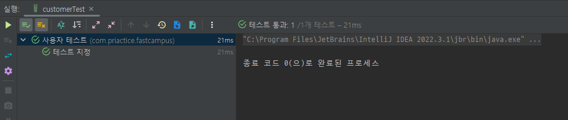

## 2023-01-31

사용하는 기능 설명 
 - @DisplayName 
   - Junit5에서 지원하는 테스트 함수이름 지정하는 함수
   - 
 - @Test
   - Junit에서 테스트 함수를 지정하기 위한 어노테이션
   - 수행시간 제한 또는 예외조건을 추가할수 있음
   - ```java
     @Test(timeout=5000) / @Test(excepted=RuntimeException.class)```
 
 - assertThatCode
   - assertJ라는 테스트를 도와주는 오픈소스 라이브러리
 ```
     // 같은지 비교
     assertThat(isContains).isEqualTo(expected); 
     // 다른지 비교
     assertThat(numbers.size()).isNotEqualTo(pivot);
     // 내부 크기 비교
     assertThat(lotto.getNumbers()).hasSize(EXPECTED_SIZE);
     // 에러 클래스 비교
     assertThatThrownBy(callable).isExactlyInstanceOf(IllegalArgumentException.class);
     // 클래스 비교 + 에러 메시지 비교
     assertThatThrownBy(() -> board.addComment(comment))
     .isExactlyInstanceOf(GoodDayException.class)
     .hasMessage(BoardExceptionSet.ALREADY_EXISTED_COMMENT.getMessage());
     // true 인지 비교
     assertThat(bishop.checkPositionRule(start, validDestination)).isTrue();
     // false 인지 비교
     assertThat(bishop.checkPositionRule(start, invalidDestination)).isFalse();
     // null 비교
     assertThat(board.getComment()).isNull();
     // null이 아닌지 비교
     assertThat(board.getComment()).isNotNull();
     // 에러가 발생하지 않았는지 비교
     assertThatCode(() -> board.validateUpdateBoard())
     .doesNotThrowAnyException();
     // 객체는 다르지만 값이 같은지 비교
     assertThat(expected).usingRecursiveComparison().isEqualTo(findBoard);
 ```
2번째 예
```
assertThat("Hello, world! Nice to meet you.") // 주어진 "Hello, world! Nice to meet you."라는 문자열은
				.isNotEmpty() // 비어있지 않고
				.contains("Nice") // "Nice"를 포함하고
				.contains("world") // "world"도 포함하고
				.doesNotContain("ZZZ") // "ZZZ"는 포함하지 않으며
				.startsWith("Hell") // "Hell"로 시작하고
				.endsWith("u.") // "u."로 끝나며
				.isEqualTo("Hello, world! Nice to meet you."); // "Hello, world! Nice to meet you."과 일치합니다.
				
assertThat(3.14d) // 주어진 3.14라는 숫자는
				.isPositive() // 양수이고
				.isGreaterThan(3) // 3보다 크며
				.isLessThan(4) // 4보다 작습니다
				.isEqualTo(3, offset(1d)) // 오프셋 1 기준으로 3과 같고
				.isEqualTo(3.1, offset(0.1d)) // 오프셋 0.1 기준으로 3.1과 같으며
				.isEqualTo(3.14); // 오프셋 없이는 3.14와 같습니다
```
